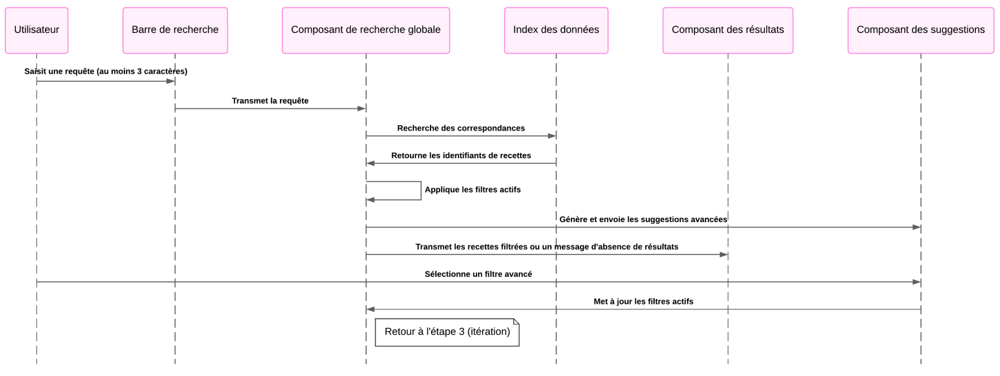

# Sup de Cuisine - Site de Recettes

Sup de Cuisine est une site de recettes de cuisine avec un moteur de recherche performant et une interface voulue intuitive.
---
Ce projet consiste à créer un site web inspiré de plateforme tel que Marmiton. L'objectif est d'offrir une recherche fluide et rapide parmi une base de données de recettes.

### Fonctionnalités principales :
- **Recherche en direct** : Trouvez des recettes rapidement en tapant dans la barre de recherche principale.
- **Filtres avancés** : Affinez les résultats avec des filtres sur les ingrédients, ustensiles et appareils.
- **Interface responsive** : Adaptée à tous les apareils.
- **Pagination** : Navigation fluide entre les pages de résultats.

---

## Algorithme de recherche

L'algorithme de recherche a été conçu pour répondre aux besoins d'une recherche performante et rapide : 

1. **Saisir utilisateur** :
    - Dès que l'utilisateur entre au moins 3 caractères dans la barre de recherche, une recherche est déclenchée.
    - Les résultats sont filtrés en temps réel dans :
        - Le titre des recetttes.
        - La description des recettes.
        - Les ingrédients associés aux recettes.

2. **Filtres avancées** :
    - Des options pour filtrer par ingrédients, ustensiles et appareils sont disponibles.
    - Les filtres sont appliqués de manière cumulative (intersection des résultats).

3. **Gestion des résultats** :
    - Si aucune recette ne correspond, un message clair est affiché.
    - Sinon, les recettes filtrées sont affichées, et les suggestions avancées sont mises à jour.

### Diagramme de l'algorithme
Voici une représentation visuelle de l'algorithme utilisé :



## Configuration locale avec Docker
### Prérequis
- Docker et Docker Compose doivent être installés.

### Etapes
1. Clonez ce dépôt : 
    ```git clone https://github.com/PavelDelhomme/htmlcssjseval.git```
    ```cd htmlcssjseval```
2. Créer un fichier <code>Dockerfile</code>
    ```FROM nginx:alpine```
    ```COPY . /usr/share/nginx/html```

3. Créer un fichier docker-compose.yml :
    ```
    version: '3.8'
    services:
        web:
            build: .
            ports:
                - "8080:80"
            volumes:
                - .:/usr/share/nginx/html:ro
    ```
4. Lancer le conteneur :
    ```docker-compose up --build```

5. Accèdez au site web <a hef="http://localhost:8080/">http://localhost:8080/</a>


### Déploiement
Le site peut être déployé sur un serveur VPS avec un conteneur Docker et configurer avec Nginx Proxy Manager pour un accès HTTPS.

### Structure du projet
- `index.html`: Page principale.
- `styles/style.css`: Feuilles de style.
- `scripts/main.js`: Script JS pour la logique de recherche et récupération des photos.
- `data/`: Contient les images et le fichier `recipes.json`

#### Auteur
Développé par PavelDelhomme dans le cadre d'un projet d'évaluation.