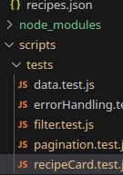

# === Suivi des tests ===

## Objectifs des tests
 - Vérifier le bon fonctionnement des fonctionnalités critiques du site.
 - Identifier les problèmes potentiels avant le déploiement.
 - Garantir une expérience utilisateur fluide et accessible.

---

## Résultats tests
Voici une représentation visuelle de l'algorithme utilisé :

---
## Tests réalisés

### Recherche et filtres
- [x] Vérification du comportement des filtres (ingrédients, ustensiles, appareils).
- [x] Test de la recherche globale avec des mots-clés spécifiques.
- [x] Vérification de la mise à jour correcte des recettes après l'application des filtres.

### Gestion des suggestions
- [x] Exclusion des tags actifs dans les suggestions affichées.
- [x] Fonctionnement de l'option "Afficher plus de tags".

### Dropdowns dynamiques
- [x] Vérification que les appareils affichés dans le dropdown sont valides après application de filtres.
- [x] Test de la sélection d'un appareil et du recalcul des recettes correspondantes.

### Pagination
- [x] Vérification de la navigation entre les pages.
- [x] Test des transitions et animations entre les pages.

### Accessibilité (a11y)
- [x] Ajout des balises `aria-label` pour les boutons et liens.
- [ ] Permettre la navigation clavier sur les suggestions de tags et les icônes de recherche.
- [x] Vérification des balises `aria-expanded`, `role`, et `aria-controls` pour les dropdowns.
- [ ] Confirmer que les suggestions de tags peuvent être sélectionnées avec la touche Enter.
- [x] S'assurer que les balises ARIA sont présentes sur les cartes de recettes.
- [x] Navigation clavier sur les recettes affichées.

---